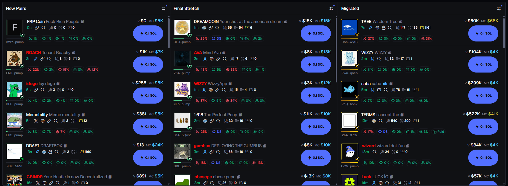
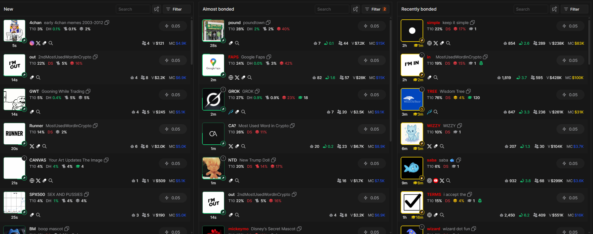

 French 
# Detecteur De Meme Coin Botté - Chrome Extension

## Dons (pour les chads)
- **SOL Wallet:** `6gjWt9rHX1ZE7kwMHgW6rUnekrpz12FPQcyNCqqCPvJR`
- **Refferal Axiom:** https://axiom.trade/@offs

Merci aux chads qui me soutiendront 🙏

---

## À quoi sert cette extension ?

Cette extension Chrome vous permet de **repérer automatiquement les meme coins bottés** sur les plateformes **Axiom** et **Padre**, en scannant les pages à la recherche d’activités suspectes ou anormalement élevées (indicatives de bots). Elle met en évidence visuellement les coins douteux directement dans l’interface utilisateur des plateformes.

### Fonctionnalités :
- Détection automatique des tokens bottés
- Surbrillance visuelle des coins suspects
- Analyse en temps réel à chaque refresh
- Compatible avec Axiom & Padre

### Aperçu de l’extension :

#### Exemple sur Axiom :

#### Exemple sur Padre :

---

## Installation manuelle de l'extension (non empaquetée)

1. **Téléchargez** ou clonez ce repo sur votre ordinateur.
2. Ouvrez **Google Chrome**.
3. Allez dans la barre d’adresse et tapez :  
   `chrome://extensions`
4. Activez le **Mode développeur** en haut à droite.
5. Cliquez sur **"Charger l’extension non empaquetée"**.
6. Sélectionnez le dossier contenant les fichiers de l’extension.

L’extension devrait maintenant apparaître dans votre barre Chrome et commencer à analyser Axiom & Padre dès que vous ouvrez ces plateformes !

---

## Attention !

- N'oubliez pas que même un coin botté peut pump (mais attention aux rugs !).

---

## Feedback

Si vous avez des suggestions ou autre chose que je devrais modifier dans cette extension ou créer dans le futur, sentez-vous libre de me l’écrire sur GitHub.

---

## PS :

Pardonnez-moi si le code n’est pas magnifique, je n’ai jamais vraiment fait de JS auparavant et celle-ci a été faite en peu de temps 😅 (je vais sûrement l’améliorer par la suite).

━━━━━━━━━━━━━━━━━━━━━━━━━━━━━━━━━━━

 English
# Meme Coin Bot Detector - Chrome Extension

## Donations (for the chads)
- **SOL Wallet:** `6gjWt9rHX1ZE7kwMHgW6rUnekrpz12FPQcyNCqqCPvJR`
- **Refferal Axiom:** https://axiom.trade/@offs

Thanks to the chads who support me 🙏

---

## What does this extension do?

This Chrome extension lets you **automatically detect botted meme coins** on **Axiom** and **Padre**, by scanning the pages for suspicious or abnormally high activity (a common sign of bots). It visually highlights suspicious coins directly inside the platform interfaces.

### Features:
- Automatic detection of botted tokens
- Visual highlighting of suspicious coins
- Real-time analysis on every page refresh
- Works with both Axiom & Padre

### Extension Preview:

#### Example on Axiom:

#### Example on Padre:

---

## Manual Installation (Unpacked Extension)

1. **Download** or clone this repo to your computer.
2. Open **Google Chrome**.
3. In the address bar, go to:  
   `chrome://extensions`
4. Enable **Developer mode** (top right).
5. Click on **"Load unpacked"**.
6. Select the folder containing the extension files.

The extension should now appear in your Chrome bar and start analyzing Axiom & Padre whenever you're browsing them!

---

## ⚠️ Warning!

- Even a botted coin can still pump — but watch out for rugs!

---

## Feedback

If you have any suggestions, ideas for improvements, or features you'd like to see in the future, feel free to open an issue here on GitHub.

---

## PS:

Forgive me if the code isn’t beautiful — I’ve never really done JS before and built this quickly 😅 (planning to improve it later).